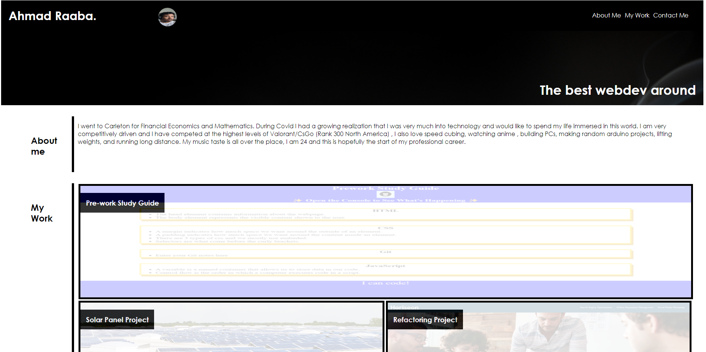
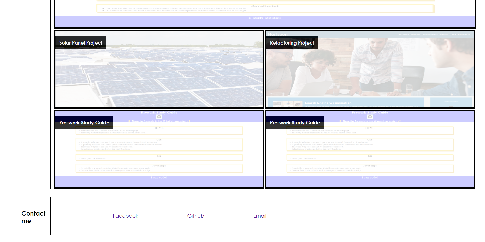

# Personal-Website-Challenge ReadME

## Description

This challenge was created in order for an employer to be able to search up my website and find out more about me! The employer will be able to see who I am through my profile picture, see a small description about me and most importantly find projects that I have completed and chose to highlight.Lastly, the employer will also find a section to contact me!

## Link To The Website

https://raaba241.github.io/personal-website-challenge/

## Screenshots

## Note for source 

The html selector, the before and after global selector, and the resizing portion of my portfolio were taught to me by my tutor. I was stuck trying to style and went through the bootcamp tutor to help make it look organized. 